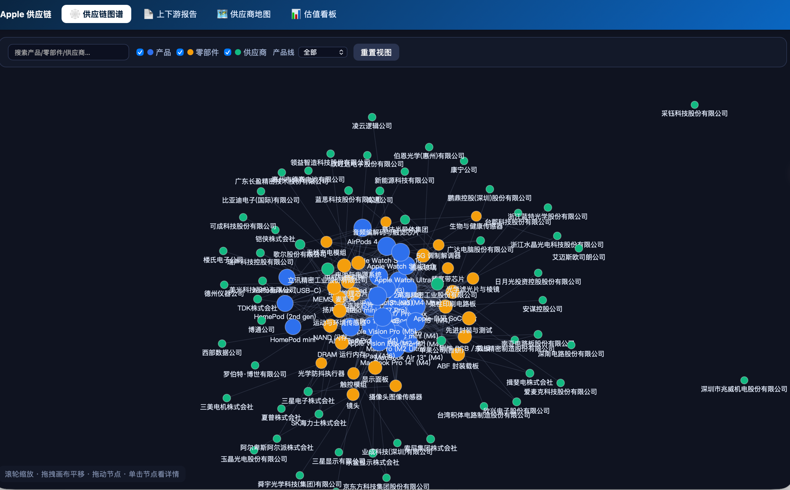
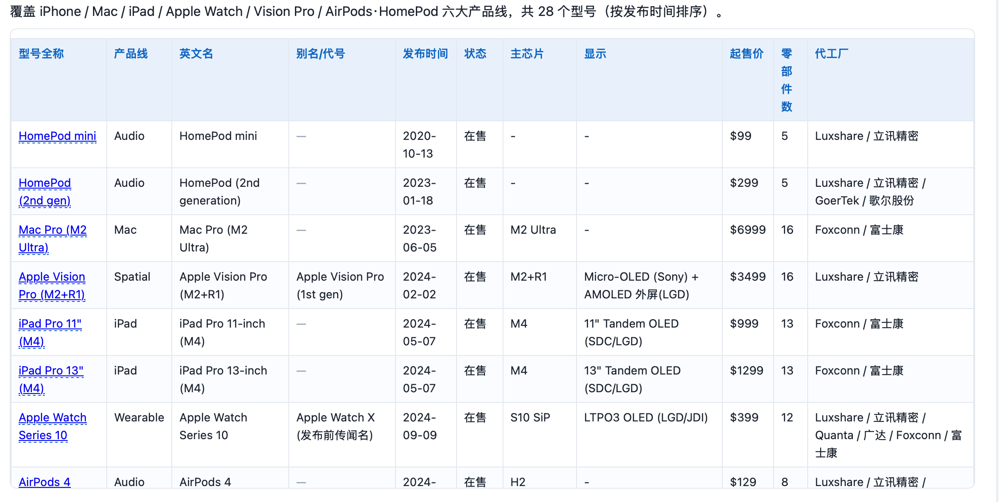
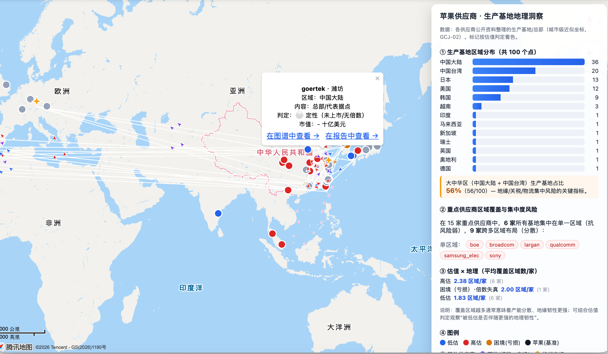
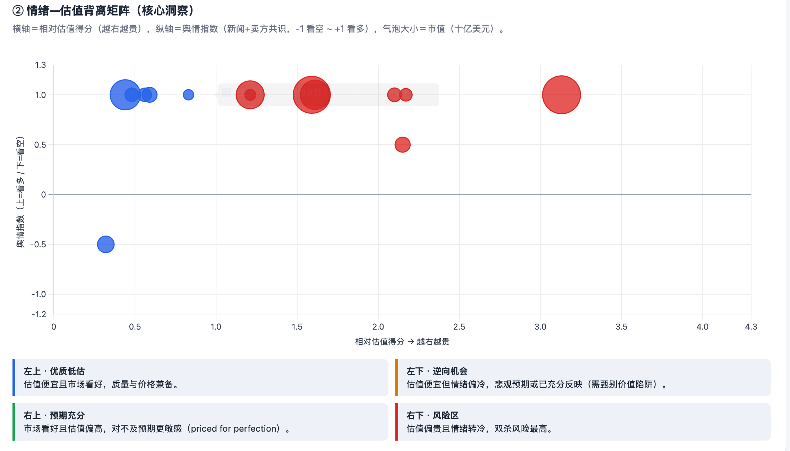

# Apple Supply Chain Graph · 苹果产品供应链上下游图谱

> 以**具体产品型号**为起点，逐层向上游拆解出核心零部件与其供应商 / 代工厂，
> 构建「产品 → 零部件 → 供应商」三层有向图，包含可导入 **Neo4j** 图数据库的结构化数据。
> 配套零依赖的交互式可视化与各供应商基本面 / 估值 / 舆情分析。
>
> 本项目同时是一个用 **AI 编程（WorkBuddy Hy3）** 端到端产出的**演示 / 探索性作品**，
> 侧重可复现的工程实现与交互体验，**并非正式的行业或投资分析**（详见「分析方法局限性」与「免责声明」）。

**An open, reproducible map of Apple's product supply chain** — from finished
product models down to components and suppliers, exportable to Neo4j, with
zero-dependency interactive visualizations.

> 🌐 **English version: [README_en.md](README_en.md)** · 中文文档见本文件。
>
> 📊 **研究用途（参考性）**：本图谱可作为供应链图分析、脆弱性建模与图神经网络（GNN）教学的**参考性实验数据**（尚非成熟基准，MIT 许可，详见下方「作为研究 / 分析用实验数据集」）。

[](data/neo4j)
[](data/neo4j)
[](data/neo4j)
[](data/neo4j)
[](data/neo4j)
[](scripts/generate.py)
[](scripts)
[](LICENSE)

---

## 目录

- [为什么做这个项目](#为什么做这个项目)
- [功能特性](#功能特性)
- [截图预览](#截图预览)
- [快速开始](#快速开始)
  - [0. 站点总览：统一导航即「融合」](#0-站点总览统一导航即融合)
  - [0.1 各页面统一导航（多页互跳，非孤岛）](#01-各页面统一导航多页互跳非孤岛)
  - [0.2 使用 Docker 一键启动（推荐用于发布 / 统计）](#02-使用-docker-一键启动推荐用于发布--统计)
  - [0.3 启用 HTTPS（有域名 + 证书）](#03-启用-https有域名--证书)
  - [0.4 部署到 GitHub Pages（纯静态托管）](#04-部署到-github-pages纯静态托管)
  - [1. 浏览图谱（零依赖）](#1-浏览图谱零依赖)
  - [2. 导入 Neo4j（你已有的实例）](#2-导入-neo4j你已有的实例)
  - [3. 从源码重新生成](#3-从源码重新生成)
- [数据模型](#数据模型)
- [作为研究 / 分析用实验数据集](#作为研究--分析用实验数据集)
- [供应商基本面与相对估值分析](#供应商基本面与相对估值分析)
- [供应商舆情分析](#供应商舆情分析)
- [供应商分析可视化看板](#供应商分析可视化看板)
- [供应链脆弱性分析（零部件 → 产品 → 产品线）](#供应链脆弱性分析零部件--产品--产品线)
- [技术栈](#技术栈)
- [目录结构](#目录结构)
- [路线图](#路线图)
- [分析方法局限性](#分析方法局限性)
- [优化方向](#优化方向)
- [文档](#文档)
- [数据来源与口径](#数据来源与口径)
- [贡献](#贡献)
- [免责声明](#免责声明)
- [许可证](#许可证)

---

## 为什么做这个项目

市面上关于苹果供应链的资料大多是「笼统的 Tier-1 名单」或「单篇新闻」，缺少把
**「某款具体型号 → 它用了哪些零部件 → 这些零部件分别由谁供应 / 谁代工」** 串成一张
可查询、可导入图数据库、可交互探索的图。

本项目用一份**单一数据源**驱动三层有向图，做到：

- **精确到型号**：不是笼统的 "iPhone"，而是 `iPhone 17` / `17 Air` / `17 Pro` / `17 Pro Max` 等；
- **可复现、可延展**：所有 CSV / JSON / 网页都由 `scripts/` 与 `tools/` 下的脚本从数据源重生成；
- **图数据库就绪**：直接产出 Neo4j 官方批量导入格式的 CSV，零 Cypher 即可导入你自己的实例；
- **开箱即用**：图谱、报告、看板均为数据内嵌的静态 HTML，双击即开，无需后端。

## 功能特性

- **精确到型号**：覆盖 iPhone / Mac / iPad / Apple Watch / Vision Pro / AirPods·HomePod 六大产品线，精确到具体型号（如 `iPhone 17 Pro`、`MacBook Pro 14" (M4)`、`Apple Vision Pro (M5)`）。
- **属性增强**：供应商节点拆分 `全称 / 英文名称 / 简称`；产品节点含 `英文名称、别名、发布时间、状态、起售价、主芯片、显示规格`。
- **图数据库就绪**：6 个 Neo4j 官方批量导入格式 CSV（`:ID` / `:LABEL` / `:START_ID` / `:END_ID` / `:TYPE` 表头），离线 / 在线两种导入方式任选。
- **零依赖可视化**：根目录 `index.html`（首页供应链图谱）等网页数据内嵌，双击即开，无需联网或数据库（看板图表依赖 CDN 上的 Chart.js，首次打开需联网）。
- **多页互跳、非孤岛**：首页图谱 / 企业列表 / 报告 / 地图 / 看板 共享同一套顶部导航（`topnav.py` 一处维护、全局生效）；跨页深链直达具体实体。这套统一导航条就是「融合」——固定在每页顶部、让用户在板块间自由跳转，无需再为各板块单独造聚合页。
- **企业列表（表格视图）**：`dist/supplier_table.html` 把图谱中全部 60 家企业以表格呈现，支持按 **地区 / 国家 / 类别 / 层级** 筛选、关键字搜索、点击列标题 **升/降序排序**，每行可一键回到图谱定位或地图打点。
- **供应商研究层**：对 15 家重点供应商做同业相对估值 + 舆情分析，结论以看板与报告形式呈现。
- **可复现**：纯 Python 标准库，无任何第三方依赖，从单一数据源可重生成全部产物。


| 页面 | 预览 |
|------|------|
| **供应链图谱**（力导向交互） |  |
| **上下游报告**（型号总览 + 跨页深链） |  |
| **供应商地图**（标记 + 物流连线） |  |
| **估值看板**（情绪—估值背离矩阵） |  |

---

## 快速开始

### 0. 站点总览：统一导航即「融合」

全站由 **5 个板块**组成，靠顶部**统一导航条**（`topnav.py` 一处维护、全局生效）互相跳转——这正是「融合」的初衷：一个固定在每页顶部的跳转栏，让用户在板块间自由穿行，而无需为每个板块单独造聚合页：

- **🕸️ 供应链图谱**（`index.html`，站点首页）：力导向交互，按产品线 / 类型筛选、搜索、定位；
- **📋 企业列表**（`dist/supplier_table.html`）：全部 60 家供应商的表格视图，支持按地区 / 国家 / 类别 / 层级筛选、关键字搜索、点击列标题升降序排序；
- **📄 上下游报告**（`dist/apple_supply_chain_report.html`）：型号总览 + 跨页深链；
- **🗺️ 供应商地图**（`tools/visualizations/supplier_geo.html`）：生产基地标记 + 物流连线；
- **📊 估值看板**（`tools/visualizations/supplier_dashboard.html`）：估值 × 舆情可视化。

各板块之间可跨页深链直达具体实体（见下节）。

### 0.1 各页面统一导航（多页互跳，非孤岛）

各页面——**首页图谱** (`index.html`)、**企业列表** (`dist/supplier_table.html`)、**上下游报告** (`dist/apple_supply_chain_report.html`)、
**供应商地图** (`tools/visualizations/supplier_geo.html`)、
**估值看板** (`tools/visualizations/supplier_dashboard.html`)——
顶部都带**同一套导航条**（`topnav.py` 生成），可一键在各页面间跳转，不再是彼此孤立的页面。

深链（跨页直达具体实体）：

| 来源 | 跳转 | 形式 |
|------|------|------|
| 报告表格中的实体 | → 图谱定位该节点 | `index.html?focus=S:tsmc` |
| 报告中的供应商 | → 地图定位该供应商 | `supplier_geo.html?supplier=tsmc` |
| 图谱节点详情 | → 报告对应章节 / 地图定位 | 链接 `apple_supply_chain_report.html#sec-suppliers` 与 `supplier_geo.html?supplier=…` |
| 首页图谱控制栏「📋 企业表格」按钮 | → 企业列表（表格视图） | `dist/supplier_table.html` |
| 企业列表每行「图谱 / 地图」 | → 图谱定位 / 地图打点 | `index.html?focus=S:tsmc`、`supplier_geo.html?supplier=tsmc` |
| 地图标记弹窗 | → 图谱 / 报告 | 弹窗内「在图谱中查看 →」「在报告中查看 →」 |

> 地图 / 看板为静态或 `geo_build.py` 生成的页面，其导航条同样由 `topnav.py` 注入。

### 0.2 使用 Docker 一键启动（推荐用于发布 / 统计）

把整站装进一个 **nginx 容器**，**一条命令**即可在 `http://localhost:8080` 提供全部页面（含入口落地页）。

通过 **http 访问**后，Umami 访问统计才会真正上报——本地 `file://` 双击打开时统计脚本被主动跳过（见 `topnav.py` 的 `location.protocol` 门控）。所以若要统计访问频次，**用 Docker / 任意 http 服务托管**是更合适的启动方式。统计配置（Website ID 等）已改为**环境变量**注入，不再硬编码在源码中：本地把值写进仓库根的 `.env`（已被 `.gitignore` 忽略），CI 则通过 `pages.yml` 的 `env:` 注入（详见 `.env.example` 与 `topnav.py`）。

前置：本机已安装 Docker（含 Compose v2）。

```bash
make up        # = docker compose up -d --build，构建镜像并后台启动
# 浏览器打开 http://localhost:8080
make down      # 停止并移除容器
make logs      # 查看容器日志
make build     # 仅构建镜像
make serve     # 不用 Docker 时，本地直接起 Python 静态服务器（同端口）
```

> 🌐 **网络受限环境（如国内）**：若 `docker.io` 拉取超时，复制一份本地配置并填入镜像源：
> ```bash
> cp .env.example .env      # 默认已写入华为云 docker.io 镜像源（完整镜像名 PYTHON_IMG/NGINX_IMG）
> make up                   # compose 自动读取 .env 的 PYTHON_IMG / NGINX_IMG 作为构建参数
> ```
> 海外可直连 `docker.io` 时无需此步（不设 `.env` 即用官方源 `python:3.11-slim` / `nginx:1.27-alpine`）。
> 也可在 Docker Desktop 的 Settings → Docker Engine 加入 `"registry-mirrors": ["https://镜像源"]` 一劳永逸。
>
> 不想用 Docker？`make serve` 或 `python3 -m http.server 8080` 直接起本地静态服务器即可，
> 效果与 Docker 一致（同样是 http 托管）。
> ⚠️ **供应商地图页**依赖腾讯位置服务 GL JS，需要**真实域名 + 有效 Key**（替换页面里的
> `__WB_TMAP_SECRET__` 占位符），`localhost` 下地图不会渲染——其余页面不受影响。
> 容器构建时会执行 `build_all.py` 重生成全部页面，改完数据后 `make up` 会自动重新构建。

### 0.3 启用 HTTPS（有域名 + 证书）

默认 `make up` 走 **HTTP**（端口 `8080`），适合本地调试、或暂无条件配置证书时由你选择 HTTP 部署。
当你已有域名和有效证书（如 Let's Encrypt 的 `fullchain.pem` + `privkey.pem`）时，用「生产覆盖」在
容器内终止 TLS、HTTP 自动跳转 HTTPS，**无需改动默认 HTTP 流程**：

```bash
mkdir -p certs
cp /path/to/fullchain.pem certs/fullchain.pem
cp /path/to/privkey.pem   certs/privkey.pem
make up-prod        # = docker compose -f docker-compose.yml -f docker-compose.prod.yml up -d --build
# 浏览器访问 https://你的域名 （HTTP 自动 301 跳转 HTTPS）
```

- 证书放在 `certs/`，**已被 .gitignore 忽略，不会提交**；`nginx.prod.conf` 从中读取（路径不符时改该文件即可）。
- 生产配置 `nginx.prod.conf` 监听 443（SSL）+ 80（跳转），含 TLS 1.2/1.3、强加密套件、HSTS 注释项。
- 若不想在容器内终止 TLS，也可在**反向代理 / Cloudflare / 云负载均衡**处终止，容器保持默认 HTTP 即可（只用 `make up`）。
- 想同时保留 HTTP 直连（不跳转）：把 `nginx.prod.conf` 里 80 端口的 `return 301` 换成正常 `location /` 服务即可。

### 0.4 部署到 GitHub Pages（纯静态托管）

本项目所有页面均为**零依赖静态文件**，天然适配 GitHub Pages。且导航全部用**相对路径**
（`topnav` 用 `../`、`../../` 拼接 `dist/...` / `tools/visualizations/...`），无论部署在：

- 用户 / 组织根域名：`https://<user>.github.io/`
- 项目子路径：`https://<user>.github.io/apple-chain-graph/`（默认，无需自定义域名）
- 自定义域名：Settings → Pages → Custom domain

跨页导航都不会 404。Umami 统计在 **https 下正常上报**（`file://` 门控不触发）；统计开关与 Website ID 通过环境变量 `ANALYTICS_WEBSITE_ID` 配置，详见 `topnav.py` 与 `.env.example`。

**自动部署（推荐）**：仓库已含 `.github/workflows/pages.yml`，push 到 `main` 即自动构建并发布。

1. 首次部署前，仓库 **Settings → Pages → Build and deployment → Source** 选 **GitHub Actions**。
2. 本机把含该 workflow 的提交推送到 `main`，GitHub 自动跑 CI 并发布。
3. 访问地址见上方三种情况；自定义域名还需在 Settings → Pages → Custom domain 填域名并按提示加 DNS。

> **多仓库共存 / 命名冲突说明（重要）**
> - **项目站点按仓库名隔离在 URL 路径下**：本仓库发布后为 `https://Coolgiserz.github.io/apple-chain-graph/`，
>   每个仓库各自拥有独立的 `/<repo>/` 路径段。你其它已发布的 GitHub Pages（如 `/other-repo/`）**完全不受影响**，
>   二者 URL 路径天然不同，**不存在站点级命名冲突**。
> - **唯一全局共享的命名空间是「自定义域名」**：一个自定义域名在同一时间只能被**一个**仓库占用。
>   因此请**不要**把别的仓库已在使用的域名设到本仓库。保持默认的 `*.github.io/apple-chain-graph/` 形式即可零冲突发布。
> - **CI 资源均为仓库级别作用域**：workflow 里的 `concurrency.group`、Pages artifact 名称、`github-pages` 环境、
>   以及部署用的 `GITHUB_TOKEN` 都只作用于**本仓库**的 Actions，**不会**干扰你其它仓库的部署或互相加锁。
> - **未来新增仓库**：每个新仓库只需自带一份 `.github/workflows/pages.yml`，各自得到 `/<其仓库名>/`，无需任何跨仓库协调
>   （同样只需遵守上面的自定义域名唯一规则）。若你在本仓库内**再建第二个** Pages workflow，请给它一个不同的
>   `concurrency.group`（如在同一个仓库里两个 workflow 都用 `group: pages` 会互相取消），跨仓库则无此问题。

**发布内容**：CI 只挑选静态产物 —— `index.html`、`dist/`、`tools/visualizations/`、`docs/`、
以及 `README.md` / `README_en.md` / `LICENSE` / `CONTRIBUTING.md`；**不发布** Python 源码、`data/`、`tools/*.py`、`.env`、`certs/`。

**地图页（默认免 Key，静态托管直接可用）**：供应商地图页（`supplier_geo.html`）运行时自动选择渲染后端——

- **默认 Leaflet + OpenStreetMap**：纯前端、免 Key、免代理，GitHub Pages 等任意静态托管**直接渲染**，
  无需任何配置（标记按估值着色、物流连线、流动动画、品类过滤、深链 `?supplier=` 全部可用）。
- **腾讯地图 GL（可选增强）**：当你自建了公开的腾讯地图签名代理、并把页面里的 `serviceHost`
  （`http://127.0.0.1:__WB_HTTP_PORT__/...`）替换为真实代理域名 + Key 时，地图自动改用腾讯原样式
  （可在 `.github/workflows/pages.yml` 用 Secrets 自动注入，见其注释）。未配置时不影响 Leaflet 默认渲染。

> 注：OSM 瓦片在国内访问可能偏慢，可在生成的地图页里把 `tile.openstreetmap.org` 换成 CartoDB / 高德等瓦片源。
> `.nojekyll` 已加入发布产物，禁用 Jekyll 以保证 `_` 前缀目录原样发布并加速构建。
> 若只想要手动发布而不用 CI，也可在仓库 Settings → Pages 选「Deploy from a branch」并把
> `main` 分支的 `/` 或 `/docs` 设为源——但需自行把构建产物提交进仓库。

### 1. 浏览图谱（零依赖）

直接双击打开根目录 **`index.html`**（或拖进浏览器）。数据已内嵌，无需联网或数据库：

- 滚轮缩放、拖拽平移、拖动节点；
- 单击节点看详情（发布时间、状态、起售价、关联供应商等）；
- 顶部按 产品 / 零部件 / 供应商 筛选、按产品线下拉过滤、搜索框定位。

### 2. 导入 Neo4j（你已有的实例）

数据已准备好，按 **[docs/neo4j-import.md](docs/neo4j-import.md)** 操作即可。两种官方方式：

- **方式 A — 离线批量导入（neo4j-admin）**：适合建一个独立新库。
  用 `NEO4J_HOME` 指定你的实例后运行：
  ```bash
  NEO4J_HOME="/你的/neo4j/实例/根目录" bash data/neo4j/import_admin.sh
  ```
- **方式 B — 在线导入（LOAD CSV）**：适合直接加进正在运行的现有库，库不用停。
  把 6 个 CSV 放进 Neo4j 的 `import/` 目录，再到 Browser 跑一段 Cypher。

> ⚠️ 数据库名不能含下划线，本脚本默认库名为 `apple-supply-chain`。
> 导入前目标库必须**停机**（neo4j-admin 是离线导入）。

### 3. 从源码重新生成

需要 Python 3.9+，无需第三方依赖（依赖清单见 `requirements.txt`，仅标准库 + 内部模块）：

```bash
# 一条命令重生成全部页面（推荐）
python3 build_all.py
# 或仅做语法检查：python3 build_all.py --check

# 也可单独运行（等价）
python3 scripts/generate.py     # 生成 data/neo4j/*.csv + data/apple_supply_chain.json
python3 scripts/report.py       # 生成 dist/apple_supply_chain_report.html（独立报告）
python3 scripts/build_viewer.py # 生成根目录 index.html（首页图谱）+ dist/graph_engine.js（共享画布引擎）
python3 scripts/build_table.py  # 生成 dist/supplier_table.html（企业列表：筛选 + 排序表格视图）
python3 tools/geo_build.py      # 生成 tools/visualizations/supplier_geo.html（供应商地图）
# 估值看板 tools/visualizations/supplier_dashboard.html 为静态页面，已注入统一导航条
```

> 图谱的画布物理引擎已抽成独立文件 **`templates/graph_engine.js`**（构建时复制到
> `dist/graph_engine.js`，数据由页面内联的 `window.SUPPLY_DATA = …` 注入），可被 Node 单测、
> IDE 也能做语法校验。该引擎为单一事实来源，首页图谱复用它；部署时首页与 `dist/` 一并发布即可。

> 各页面共享 `topnav.py` 的统一导航条，改一处即可全局生效；报告内容由 `report.py` 的
> 可复用 builder 渲染（传 `jump=True, mode="web"` 时实体自动带上跨页 `<a>` 深链）。
> 新增板块只需在 `topnav.py` 的 `NAV_ITEMS` 里加一行，即会出现在所有页面的导航中。

## 数据模型

三层节点 + 三类关系：

| 节点 | 关键属性 |
|------|----------|
| **Product** | `name`(型号全称), `product_line`, `english_name`, `alias`(别名/代号), `release_date`(发布时间), `release_year`, `status`, `soc`, `display`, `price_usd` |
| **Component** | `name`(中文全称), `english_name`, `category`, `subcategory` |
| **Supplier** | `name`(全称), `english_name`, `short_name`(简称), `country`, `region`, `category`, `tier`(层级) |

关系：`Product -[USES_COMPONENT]-> Component`、`Component -[SUPPLIED_BY]-> Supplier`、
`Product -[ASSEMBLED_BY]-> Supplier`（代工）。完整字段含义见
**[docs/data-model.md](docs/data-model.md)**。

## 作为研究 / 分析用实验数据集

> ⚠️ **谨慎使用**：本图谱目前仍是**探索性、参考性的实验数据**，**尚不是一个经校验、标准化的成熟数据集 / 基准**。
> 它规模有限（约 115 节点 / 510 关系）、由 AI 联网检索公开资料二手整合、属单点时点快照，存在口径不一致与模型幻觉风险。
> 下文仅说明「如何把它当作实验数据来用」，不代表它已具备基准数据的质量。

本仓库的全部产出（图数据、Neo4j 导入 CSV、脆弱性分析结果、可视化）可作为一份
**可复现的参考性实验数据**，用于教学演示与初步探索——而非作为权威基准：

- **图结构示例数据**：三层有向图（`Product → Component → Supplier`）规模固定、可复现，
  适合作为**图神经网络（GNN）节点分类、链路预测、社群检测**的**教学示例或算法冒烟测试**；
  边的方向语义清晰，无需额外清洗即可喂给 `networkx` / `PyG` / `DGL` 等工具。
  但请注意样本量很小，仅适合教学与原型验证，**不宜用于宣称模型「在供应链基准上达到 SOTA」**。
- **供应链风险建模样本**：`tools/run_risk.py` 产出的「单点依赖 / 脆弱性」结果
  （含单点部件如 `audio_codec → Cirrus Logic`、最脆弱产品线 `iPhone 约 0.50`）
  可作为**供应链脆弱性建模、风险传导、鲁棒性分析**的**输入特征或标签草案**，
  仍需结合一手数据校验后才可用于正式研究。
- **端到端可复现**：纯 Python 标准库、单一数据源（`data/apple_supply_chain.json`），
  一条 `python3 build_all.py` 即可重生成全部产物，**数据与代码彻底分离**——
  改 CSV / JSON 即重算，便于复现、对照实验与二次开发。
- **许可与署名**：以 **MIT 许可**发布，可自由用于学术、教学与二次创作。
  但请**务必注明数据口径与局限性**（本数据是 AI 联网检索公开资料的二手整合、单点快照，
  见「[分析方法局限性](#分析方法局限性)」与「[数据来源与口径](#数据来源与口径)」），
  不要把它当作一手事实或正式投资 / 采购依据。

> 想把图谱转成 GNN 训练数据？直接用 `data/apple_supply_chain.json` 的 `nodes`/`edges`
> 即可构造邻接矩阵；或把 6 个 Neo4j CSV 用 LOAD CSV 导入后导出为边表。
> 引用时建议同时给出版本（commit）与数据快照时间，并明确说明这是「探索性参考数据、非基准」。

## 供应商基本面与相对估值分析

在「图谱（结构）」之外，额外对 **60 家供应商中的 15 家重点企业**做了基本面与估值研究：
营收 / 净利 / 毛利率 / ROE、P/E·P/B·EV/EBITDA 等倍数，并用**同业相对估值**判断其当前被
高估 / 低估 / 合理，逐家附**发展趋势、近况、数据来源链接**。

工具完全基于 Python 标准库，数据层与代码分离（`tools/data/supplier_fundamentals.csv` 可人工核改）：

```bash
python3 tools/run_analysis.py                 # 全量分析 → tools/output/{supplier_analysis.md,json}
python3 tools/run_analysis.py --id tsmc       # 只看某一家（打印到 stdout）
python3 tools/run_analysis.py --md out.md --json out.json
python3 tools/run_risk.py                    # 供应链脆弱性 → tools/output/{supply_chain_risk.md,json}
python3 tools/run_risk.py --top 5            # 仅打印 Top5 最脆弱产品线/产品/零部件
```

- 估值方法：当前倍数 ÷ **同业组（sector）中位** → 取 P/E、P/B、EV/EBITDA 三比值均值。
  `< 0.85` 低估、`> 1.15` 高估、其余合理；同业不足时回退全样本中位（报告中标注）。
- 苹果作为终端厂 / 客户，单独列为 `OEM(Benchmark)` 基准，不参与供应商同业比较。
- 完整方法、口径与局限性见 **[docs/supplier-analysis.md](docs/supplier-analysis.md)**。
- 结论仅基于某一时点（2026 年 7–8 月）行情快照，**不构成任何投资建议**。

## 供应商舆情分析

在基本面 / 估值之外，再对这 **15 家重点供应商**做了一层**舆情（市场情绪）分析**：
抓取 2026 年近期主流财经媒体的报道基调（新闻情绪：正面 / 中性 / 负面），汇总卖方研报的
评级分布与共识方向（分析师情绪：看多 / 中性 / 看空），并提炼**关键催化剂、关键风险与可点击的来源链接**。
报告自动把上一节的**估值结论**并排展示，便于识别「情绪—估值」背离（例如新闻偏负面但估值已低估、
或情绪火热但估值已偏高）。

```bash
python3 tools/run_sentiment.py                 # 生成 tools/output/supplier_sentiment.md
python3 tools/run_sentiment.py --id qualcomm    # 只看某一家
```

- 数据层与代码分离：`tools/data/supplier_sentiment.csv` 可人工核改（字段含 news_summary / analyst_consensus / key_catalysts / key_risks / sources）。
- 方法论、口径与局限（含跨市场分析师覆盖密度差异、快照时点敏感等）见报告第三节。
- 舆情为**定性 + 共识**判断而非量化模型，**不构成任何投资或采购建议**。

## 供应商分析可视化看板

`tools/visualizations/supplier_dashboard.html` 是一个**零后端、双击即开**的交互式看板，
把估值 + 舆情结论直观呈现。包含 6 张图：

1. **同业相对估值分布** — 水平条形，按得分升序，蓝 / 绿 / 红区分低估 / 合理 / 高估。
2. **情绪—估值背离矩阵（核心）** — 气泡图：横轴＝相对估值得分（越右越贵）、
   纵轴＝舆情指数（新闻 + 卖方共识）、气泡大小＝市值。四象限一眼识别「优质低估 /
   逆向机会 / 预期充分 / 风险区」。
3. **舆情分布** — 新闻情绪、卖方共识两个环形图。
4. **盈利质量对比** — ROE × 净利率气泡图（气泡大小＝营收）。
5. **行业市值分布 + 明细表** — 各赛道总市值柱图 + 15 家关键指标表。

> 数据源：`tools/data/supplier_fundamentals.csv` + `supplier_sentiment.csv` +
> `tools/output/supplier_analysis.json`。图表依赖 CDN 上的 Chart.js（首次打开需联网）。

## 供应链脆弱性分析（零部件 → 产品 → 产品线）

在估值 / 舆情之外，新增一层**图结构视角的供应链风险分析**：从「每个零部件有多少供应商」
出发，自下而上聚合出产品、再上卷到产品线的脆弱性，回答「哪条产品线面临的供应链风险最大」。

模型（朴素 / 基础口径，详见 **[docs/supply-chain-risk.md](docs/supply-chain-risk.md)**）：

- **零部件脆弱性** `V = 1 / n`（n = 该组件供应商数）：供应商越少越脆弱；`n = 1` 即单点依赖（断供即停产），`V = 1.0`；`n = 0`（缺供应数据）同样按最脆弱处理。
- **产品脆弱性** = `0.5 × 零部件脆弱性均值`（整体暴露） + `0.3 × 最弱环节`（最大单部件脆弱性） + `0.2 × 单点部件占比`，综合得 `[0,1]` 区间分数。
- **产品线脆弱性** = 其下产品脆弱性的均值上卷，并汇总最弱环节与单点部件总数。

```bash
python3 tools/run_risk.py                 # 全量分析 → tools/output/{supply_chain_risk.md,json}
python3 tools/run_risk.py --top 5         # 仅打印 Top5 最脆弱产品线/产品/零部件
python3 tools/run_risk.py --md out.md --json out.json
```

- 结论完全由图数据驱动（`data/apple_supply_chain.json` 单一来源），纯标准库、零三方依赖。
- 当前口径以「供应商数量」为主信号；组件供应商的**地理分散度**（覆盖国家数）作为参考字段一并输出——同国多源不算真冗余，便于人工识别「伪冗余」陷阱。**不构成任何采购或投资建议**。

## 技术栈

| 层 | 技术 | 说明 |
|----|------|------|
| 数据处理 | Python 3.9+（标准库） | `scripts/` 与 `tools/` 下生成脚本，**零第三方依赖** |
| 首页图谱可视化 | 原生 Canvas + 自写力导向布局 | `index.html`（首页），数据内嵌，双击即开 |
| 看板可视化 | Chart.js（CDN） | `supplier_dashboard.html`，首次打开需联网 |
| 地图 | 腾讯位置服务 GL JS | `supplier_geo.html`（需在你自己的域名下运行） |
| 图数据库 | Neo4j（官方批量导入格式 CSV） | 6 个 CSV，离线 / 在线导入任选 |
| 图数据 | JSON（`data/apple_supply_chain.json`） | 全量节点 + 边 + 字段字典 |

## 目录结构

```
apple_supply_chain/
├── README.md                 # 中文文档（本文件）
├── README_en.md              # 英文文档（English version）
├── LICENSE                   # MIT
├── CONTRIBUTING.md           # 贡献指南
├── requirements.txt          # 依赖清单（仅标准库，无第三方依赖）
├── build_all.py              # 统一构建入口：一条命令重生成全部页面
├── Dockerfile                # 多阶段构建：python 生成静态页 → nginx 托管
├── docker-compose.yml        # 一键启动（make up）
├── Makefile                  # 常用快捷键（up / down / logs / serve / build）
├── nginx.conf                # 容器内 nginx 配置（UTF-8 / gzip / 长缓存）
├── .dockerignore             # 构建上下文排除项
├── index.html                # 首页：供应链图谱（站点入口，力导向交互，双击即开）
├── .gitignore
├── data/                     # 数据产物
│   ├── apple_supply_chain.json   # 完整图数据（nodes + edges + 数据字段字典）
│   └── neo4j/                # Neo4j 官方批量导入格式
│       ├── products.csv
│       ├── components.csv
│       ├── suppliers.csv
│       ├── rel_product_component.csv
│       ├── rel_component_supplier.csv
│       ├── rel_product_assembly.csv
│       ├── import_admin.sh   # 离线批量导入脚本（neo4j-admin）
│       └── refresh_import.sh # 同步 CSV 到你的 import 目录
├── scripts/                  # 数据生成脚本（可复现）
│   ├── generate.py           # 生成 CSV + JSON
│   ├── report.py             # 生成 HTML 分析报告（可复用 builder，支持 jump 深链）
│   ├── build_viewer.py       # 生成首页交互式图谱（根 index.html，引擎复用 templates/graph_engine.js）
│   └── build_table.py        # 生成企业列表：dist/supplier_table.html（表格筛选+排序）
├── index.html                # 首页：供应链图谱（力导向交互，双击即开）
├── templates/                # 网页前端模版（HTML/JS/CSS 单独维护，脚本填数据生成页面）
│   ├── graph_engine.js       # 共享图谱画布物理引擎（首页图谱单一事实来源）
│   ├── graph_page.html       # 首页图谱 HTML 模版
│   ├── graph_bootstrap.js    # 首页图谱启动脚本
│   └── table_page.html       # 企业列表（表格视图）HTML 模版（内联筛选/排序 JS）
├── topnav.py                 # 各页面共享的统一顶部导航条（单一来源，改一处全局生效）
├── tools/                    # 供应商基本面与相对估值分析（可复现，纯标准库）
│   ├── run_analysis.py        # CLI：合并三源 → 跑估值 → 输出 md/json
│   ├── run_sentiment.py       # CLI：生成供应商舆情分析报告
│   ├── run_risk.py            # CLI：供应链脆弱性分析（零部件→产品→产品线）→ 输出 md/json
│   ├── data/
│   │   ├── supplier_fundamentals.csv  # 15 家重点供应商基本面+倍数+来源
│   │   └── supplier_sentiment.csv     # 15 家重点供应商舆情（新闻/分析师/催化剂/风险/来源）
│   ├── supplier_research/     # 分析引擎（纯标准库）
│   │   ├── universe.py        # 代码/交易所/币种/sector 同业分组
│   │   ├── analysis.py        # 三源合并编排
│   │   ├── valuation.py       # 同业相对估值引擎（当前倍数 vs 同业中位）
│   │   ├── report.py          # 渲染 valuation markdown + json
│   │   ├── sentiment.py       # 舆情加载与渲染
│   │   └── risk.py            # 供应链脆弱性引擎（零部件脆弱性 + 产品/产品线聚合）
│   └── output/                # 生成的供应商分析产物
│       ├── supplier_analysis.md
│       ├── supplier_analysis.json
│       ├── supplier_sentiment.md
│       ├── supply_chain_risk.md
│       └── supply_chain_risk.json
├── docs/                     # 文档
│   ├── neo4j-import.md       # Neo4j 导入详细教程（你自己的实例）
│   ├── data-model.md         # 数据模型与字段字典
│   ├── supplier-analysis.md  # 供应商基本面与相对估值：方法/口径/局限
│   └── screenshots/          # README 截图（见「截图预览」一节）
└── dist/                     # 生成的网页产物
    ├── apple_supply_chain_report.html  # 分析报告（独立页）
    ├── supplier_table.html       # 企业列表：全部 60 家供应商的筛选 + 排序表格视图
    ├── graph_engine.js           # 共享图谱画布物理引擎（首页 index.html 复用）
    └── graph_bootstrap.js        # 首页图谱启动脚本
```

## 路线图

- [x] 三层有向图 + Neo4j 官方导入格式
- [x] 零依赖交互式图谱（力导向、筛选、搜索、定位）
- [x] 上下游报告 + 跨页深链
- [x] 各页面统一导航（多页互跳）
- [x] 15 家重点供应商：同业相对估值 + 舆情分析 + 可视化看板
- [x] 供应链脆弱性分析（零部件 → 产品 → 产品线，图结构单点依赖视角）
- [ ] 数据时效自动化更新（行情快照刷新脚本）
- [ ] 更多产品线 / 未发布机型的覆盖补全
- [ ] 图谱与地图的双向联动（点击供应商同时在高亮其上下游链路）
- [x] 英文版文档与多语言界面（README_en.md + 界面 i18n：zh/en/fr/ja）

## 分析方法局限性

本项目本质上是**用 AI 编程快速搭建的一个演示 / 探索性作品**，其分析结论存在以下系统性局限，**不应作为正式研究或决策依据**：

- **数据来源为二手整合**：全部数据由 AI 通过联网搜索公开资料（供应链报告、新闻、研报摘要）整合而成，非一手披露；不同来源口径、币种、时点不一致，且公开资料本身可能受厂商叙事、媒体立场或**水军 / 刷量**干扰，结论需人工核验。
- **估值方法粗略**：同业相对估值以 `sector` 粗分组 + 中位倍数（P/E、P/B、EV/EBITDA 取均值）判断高估 / 低估，未考虑跨市场（A 股 / 港股 / 美股）估值体系差异、成长性、资本结构与会计准则差异；仅单时点快照，无历史分位与趋势。
- **舆情为定性共识、非量化模型**：新闻情绪与分析师范畴为人工/AI 归纳的「正面 / 中性 / 负面」标签，未做情感强度量化；不同市场分析师覆盖密度不均，结论代表性有限。
- **图谱关系为二元、无权重**：边仅表示「是否供应 / 代工」，不含份额、金额、产量权重；供应商 `tier` 层级为定性标注，未建模真实依赖强度与替代弹性；部分未发布机型仅为前瞻。
- **AI 生成固有风险**：数据由模型联网检索并整合，可能存在**幻觉、过时或张冠李戴**；代码示例与文案同样需审阅，不能默认正确。

## 优化方向

针对以上局限，后续可从**技术 / 分析方法 / 数据**三个维度改进：

**技术**
- 增加行情快照自动刷新脚本（定时拉取、生成新版本 JSON），让估值结论可随时间更新。
- 图谱与地图双向联动：点击供应商同时在图谱高亮其上下游链路、在地图聚焦其基地。
- 引入数据校验与溯源：每条数值带 `source` 链接，生成时做一致性检查；接入自动化测试 / CI 防止回归。
- 多语言（i18n）界面与英文文档；把 Umami 访问统计进一步做成简易看板，反哺内容优先级。

**分析方法**
- 估值从「截面中位倍数」升级为**多年 PE / PB 历史分位** + **EV/EBITDA 与 DCF 交叉验证**，区分成长性与资本结构。
- 舆情改为**量化情感分析（NLP）**，输出情绪强度分数与时间序列，识别预期拐点。
- 在图谱上做**社群检测（community detection）**识别核心枢纽节点，并构建**供应链风险传导**模型（单点断供的波及范围）。

**数据**
- 接入一手数据源（财报 / 公告 API、交易所披露），区分不同市场估值口径。
- 把关系边补上**份额 / 营收权重**，使「主要供应商」从定性走向定量。
- 扩大产品线覆盖、建立常态化的数据更新 + 人工核验流程，降低对单一时点快照的依赖。

## 文档

- [README_en.md](README_en.md) — 英文版文档（English version）
- [docs/neo4j-import.md](docs/neo4j-import.md) — Neo4j 导入详细教程（聚焦你已有的实例）
- [docs/data-model.md](docs/data-model.md) — 数据模型与字段字典
- [docs/supplier-analysis.md](docs/supplier-analysis.md) — 供应商基本面与相对估值：方法 / 口径 / 局限
- [docs/supply-chain-risk.md](docs/supply-chain-risk.md) — 供应链脆弱性（零部件→产品→产品线）：模型 / 权重 / 局限

## 数据来源与口径

- **数据来源**：本项目的全部数据由 **WorkBuddy** 通过**联网搜索公开资料**（供应链研究报告、财经新闻、卖方研报摘要、苹果公开供应商名单等）整合而成，属于二手资料的归纳与再组织，**仅供参考与学习交流**。
- 来源包括：公开供应链报告（2024–2026）+ 苹果 2024 年供应商名单（187 家核心供应商，约占直接支出 98%）等；公开资料本身可能受厂商叙事、媒体立场或水军 / 刷量干扰，结论需以官方一手披露为准。
- 型号覆盖截至 2025–2026 年在售 / 已发布主力机型；部分未发布机型仅作前瞻。
- 供应商份额（share）仅对公开披露较明确的少数环节量化，其余以「主要供应商」定性。
- 数据用于产业链结构研究与教学，**不构成任何投资或采购建议**。
- 数据口径与局限详见 `dist/apple_supply_chain_report.html` 第十节，以及上文「[分析方法局限性](#分析方法局限性)」。

## 贡献

欢迎 Issue 与 PR！新增 / 修正供应商关系、补充型号、改进估值口径等均非常有价值。
开始前请先阅读 **[CONTRIBUTING.md](CONTRIBUTING.md)**。

## 免责声明

- **项目定位**：本项目更多在于**演示与探索「用 AI 编程（WorkBuddy）端到端产出一个可视化分析项目」的效果**，重点是可复现的工程实现与交互体验，而非一份正式的行业 / 投资分析。
- 其中涉及的供应商基本面、估值与舆情结论，均由 AI 联网检索公开资料整合而成，仅基于某一时点的快照，**不应作为正式分析、投资、采购或任何决策依据**。
- 数据可能存在错漏、过时或模型幻觉，以**官方一手披露**为准；使用前请自行核验。
- 详见「[分析方法局限性](#分析方法局限性)」与「[数据来源与口径](#数据来源与口径)」。

## 许可证

[MIT](LICENSE) © 2026 Apple Supply Chain Graph contributors.
